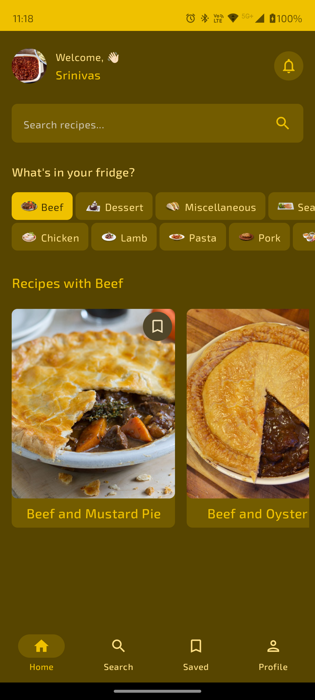
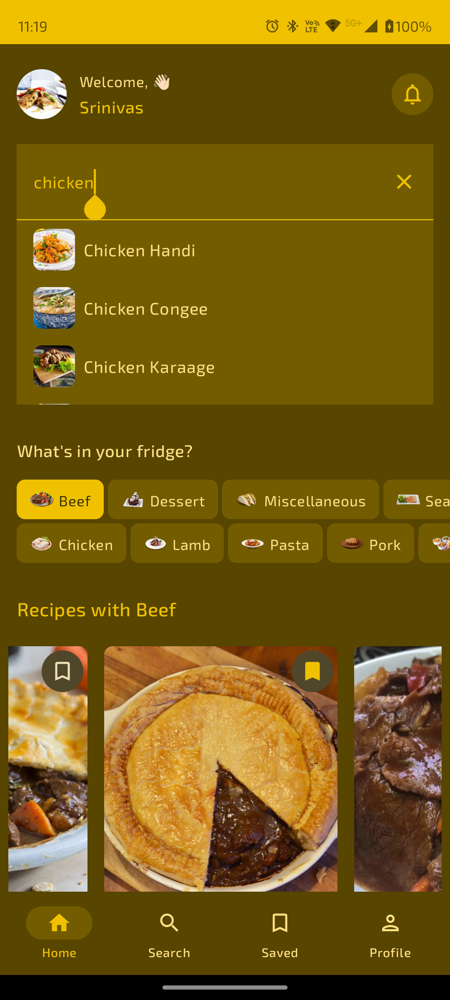
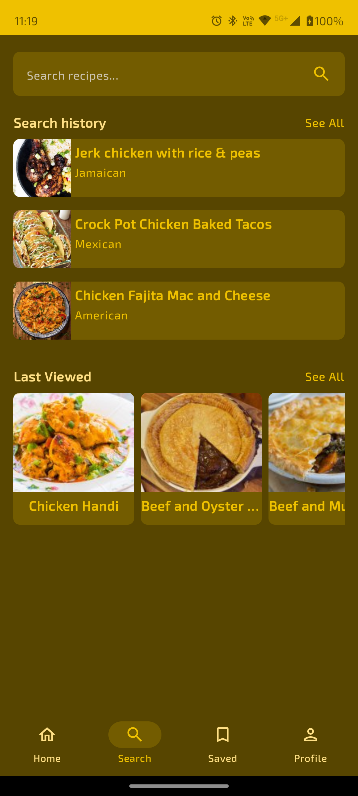
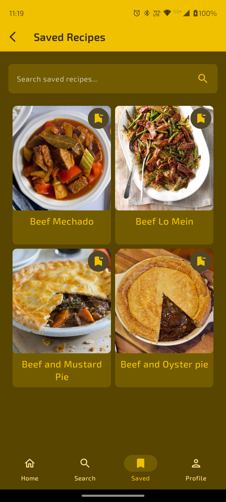
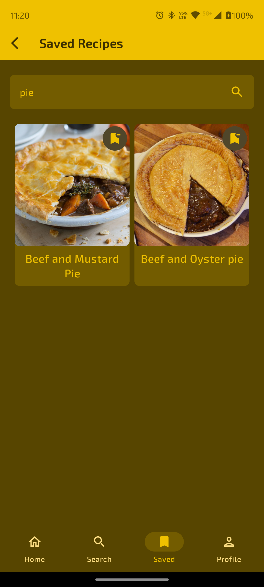
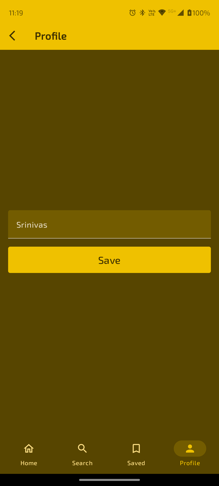

# Recipe Finder

The Recipe Finder app is a convenient tool for anyone seeking culinary inspiration or looking to explore new dishes.Users can search for recipes based on ingredients they have on hand or specific cuisine types.


## API Reference

### TheMealDb
https://www.themealdb.com/api.php

Free Endpoints
- Search meal by name
- List all meals by first letter
- Lookup full meal details by id
- Lookup a single random meal
- List all meal categories
- List all Categories, Area, Ingredients
- Filter by main ingredient
- Filter by Category
- Filter by Area

Paid Endpoints
- Lookup a selection of 10 random meals
- Latest Meals
- Filter by multi-ingredient 


## Run Locally

Clone the project

```bash
  git clone https://github.com/Srinivas1109/Recipe-Finder-App.git
```

Open the project directory with Android Studio

```bash
  Click Run
```


## Dependencies

dependencies {

    implementation(libs.androidx.core.ktx)
    implementation(libs.androidx.lifecycle.runtime.ktx)
    implementation(libs.androidx.activity.compose)
    implementation(platform(libs.androidx.compose.bom))
    implementation(libs.androidx.ui)
    implementation(libs.androidx.ui.graphics)
    implementation(libs.androidx.ui.tooling.preview)
    implementation(libs.androidx.material3)
    testImplementation(libs.junit)
    androidTestImplementation(libs.androidx.junit)
    androidTestImplementation(libs.androidx.espresso.core)
    androidTestImplementation(platform(libs.androidx.compose.bom))
    androidTestImplementation(libs.androidx.ui.test.junit4)
    debugImplementation(libs.androidx.ui.tooling)
    debugImplementation(libs.androidx.ui.test.manifest)

    // Retrofit
    implementation(libs.retrofit)
    // Gson Convertor
    implementation(libs.converter.gson)

    // Hilt
    implementation(libs.hilt.android)
    kapt(libs.hilt.android.compiler)

    // Viewmodel
    implementation(libs.androidx.lifecycle.viewmodel.compose)
    implementation(libs.androidx.lifecycle.runtime.compose)

    // Navigation
    implementation(libs.androidx.navigation.compose)
    // Hilt Navigation
    implementation(libs.androidx.hilt.navigation.compose)

    // preferences datastore
    implementation(libs.androidx.datastore.preferences)

    // Splash screen
    implementation(libs.androidx.core.splashscreen)

    // Material icons
    implementation(libs.androidx.material.icons.extended.android)

    // Coil
    implementation(libs.coil.compose)

    // Room
    implementation(libs.androidx.room.runtime)
    kapt(libs.androidx.room.compiler)

    // Coroutines
    implementation(libs.androidx.room.ktx)
}

## Screenshots








